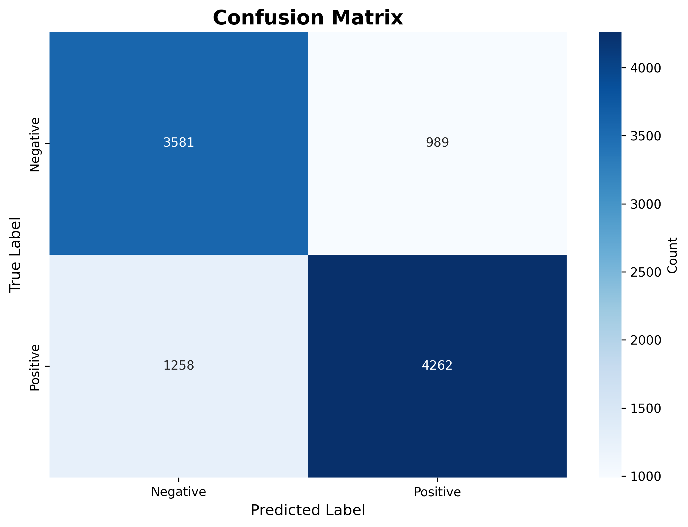

# GoEmotions-Sentiment-Analysis

This project performs sentiment analysis on the GoEmotions dataset using machine learning techniques to classify text into positive and negative sentiments.

## Project Overview

The project includes:
- Data preprocessing and analysis
- Model training and evaluation
- Performance visualization including confusion matrix
- Jupyter notebooks for interactive analysis

## Model Performance

### Confusion Matrix

The confusion matrix below shows the performance of our sentiment classification model:



**Interpretation:**
- **True Negatives (TN):** 3,581 - Correctly classified negative sentiments
- **False Positives (FP):** 989 - Negative sentiments incorrectly classified as positive
- **False Negatives (FN):** 1,258 - Positive sentiments incorrectly classified as negative
- **True Positives (TP):** 4,262 - Correctly classified positive sentiments

**Performance Metrics:**
- **Accuracy:** (TN + TP) / Total = (3,581 + 4,262) / 10,090 ≈ 77.7%
- **Precision:** TP / (TP + FP) = 4,262 / (4,262 + 989) ≈ 81.2%
- **Recall:** TP / (TP + FN) = 4,262 / (4,262 + 1,258) ≈ 77.2%

## Files

- `project.ipynb` - Main analysis notebook
- `simple_project.ipynb` - Simplified version
- `sample.ipynb` - Sample analysis
- `goemotions_train.csv` - Training dataset
- `goemotions_test.csv` - Test dataset
- `goemotions.csv` - Complete dataset
- `requirements.txt` - Python dependencies

## Setup

1. Install dependencies:
```bash
pip install -r requirements.txt
```

2. Run the Jupyter notebooks to reproduce the analysis.

## Results

The model demonstrates good performance in distinguishing between positive and negative sentiments, with the confusion matrix showing a balanced distribution of predictions across both classes.